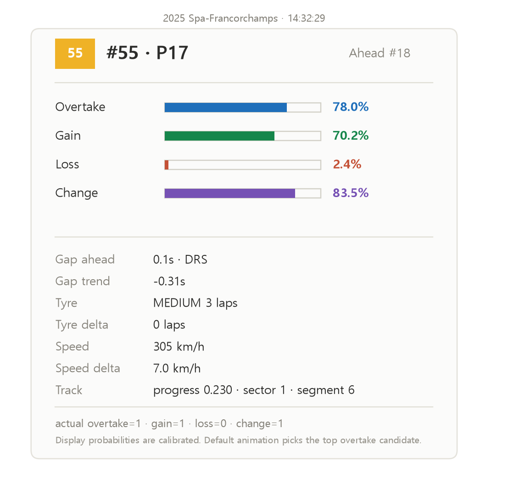

# F1 추월 예측 파이프라인 (f1-overtake-pipeline)

OpenF1 공개 데이터로 **레이스 중 추월·순위 변동을 예측**하는 머신러닝 파이프라인.
`수집 → 정렬 → 라벨링 → 피처 → 학습 → 보정 → 평가 → Unity 계약 export`를
하나로 관통한다. F1 XR 프로젝트의 **입문자 튜토리얼 AI**에 "예측형 능동 안내"
(“곧 추월할 것 같아요”)를 붙이기 위한 모델 공장이다.

> **역할 분리:** 이 레포는 모델을 **학습·평가하는 공장**이다.
> 실제 서비스(튜토리얼 서버 F1_XR_AI)는 여기서 나온 **완성 모델(`.txt` + calibration)만**
> 가져가 추론한다. → [Unity/서버 연동](#unity--서버-연동) 참고.

---

## 무엇을 예측하나

한 시점 `(t, 드라이버)`에서, **앞으로 30초 안에** 다음이 일어날 확률을 낸다.

| 출력 | 뜻 |
| --- | --- |
| `overtake_probability` | 선택 드라이버가 **바로 앞차를 추월**할 확률 |
| `position_gain_probability` | 순위가 **오를** 확률 |
| `position_loss_probability` | 순위가 **내려갈** 확률 |
| `position_change_probability` | 상승·하락 **둘 중 하나라도** 일어날 확률 |

- **모델**: LightGBM(gradient boosting) + **isotonic 보정**(raw 확률 → 표시용 확률)
- **지평(horizon)**: 30초 · **격자**: 1초 · **배틀 필터**: 앞차 gap ≤ 2초 구간
- **피처**: 26개 (스키마 `event_type_v1_26`)

---

## 성능 (미학습 서킷 held-out 평가)

**Spa(벨기에)를 학습에서 완전히 제외**하고 그 경기로만 평가 — 실제 일반화 성능.
누수검증 통과: 학습/평가 세션 겹침 **0건**, 평가 서킷이 학습에 등장 안 함.

| 타깃 | OOF ROC-AUC | OOF PR-AUC | **Spa ROC-AUC** | **Spa PR-AUC** |
| --- | :---: | :---: | :---: | :---: |
| overtake | 0.888 | 0.366 | **0.853** | 0.237 |
| position_gain | 0.894 | 0.387 | **0.782** | 0.323 |
| position_loss | 0.913 | 0.315 | **0.681** | 0.134 |
| position_change | 0.888 | 0.403 | **0.774** | 0.370 |

추월은 드문 사건(양성률 ≈ 2.9%)이라 PR-AUC 기준으로 본다. 규칙 baseline 대비
전 구간 우위. 상세는 [`results/external_eval_spa_2025_report.json`](results/external_eval_spa_2025_report.json).



---

## 26개 피처 (스키마 `event_type_v1_26`)

| 그룹 | 피처 |
| --- | --- |
| 상황(배틀) | `gap_ahead`, `gap_trend`, `position`, `position_delta`, `same_lap` |
| 속도·DRS | `speed`, `speed_delta`, `drs_range`, `drs_active` |
| 타이어 | `tyre_age`, `tyre_age_delta` |
| 트랙 위치 | `track_progress`, `track_progress_sin`, `track_progress_cos`, `sector`, `segment` |
| 서킷·컨텍스트 | `season`, `circuit_key`, `circuit_type_code`, `is_lap1`, `restart_phase` |
| 날씨 | `air_temperature`, `track_temperature`, `humidity`, `rainfall`, `weather_regime_code` |

상위 기여 피처는 `gap_ahead`·`gap_trend`(접근 추세)·`drs_range`. 결측은 `-1.0`으로 채운다.

---

## 설치 & 실행

```bash
# Python 3.11+ 권장
python -m venv .venv
# Windows: .venv\Scripts\activate  |  macOS/Linux: source .venv/bin/activate
pip install -r requirements.txt

# 1) 빠른 관통(단일 경기, 2024 바레인) — 파이프라인이 도는지 확인용
python pipeline.py

# 2) 본 학습(다중 서킷) — 5개 서킷, 2023·2024 학습 / 2025 held-out
python train_races.py --races initial

# 3) 미학습 경기로 평가(예: Spa)
python evaluate_external_race.py --model-run races_initial_event_type_final

# 4) Unity/서버 연동 계약 export
python export_unity_contract.py --run-name races_initial_event_type_final

# 5) 시각화(예측 확률 재생)
python visualize_final.py
```

실행 산출물은 모두 `data/`(gitignore)에 쌓인다:
`data/raw/`(원시 JSON) · `data/processed/`(피처+라벨 parquet) · `data/models/`(모델·보정·계약).

---

## 파일 구성

| 파일 | 역할 |
| --- | --- |
| `config.py` | 대상 시즌·서킷·윈도우·경로 설정 (여기만 바꾸면 조정) |
| `pipeline.py` | **단일 경기** 관통 스캐폴드(2024 바레인) — 구조 검증용 |
| `train_races.py` | **다중 서킷 본 학습** — 수집·정렬·라벨·피처·학습·보정 (메인) |
| `train_bahrain_years.py` / `train_bahrain_final.py` | 바레인 단일 서킷 학습 변형 |
| `evaluate_external_race.py` | 학습에 없던 경기로 **일반화 성능 평가**(누수검증 포함) |
| `audit_race_model.py` | 라벨 균형·분할 누수·이벤트 파싱·피처 의존 **감사** |
| `export_unity_contract.py` | Unity/서버용 **추론 계약(JSON)** export |
| `overtakes.py` | 실제 순위 상승(추월 추정) 순간 목록 출력 |
| `visualize.py` / `visualize_final.py` | 예측 확률을 패널/애니메이션으로 재생 |
| `results/` | 커밋된 핵심 산출물(계약·평가리포트·시각화) — [설명](results/README.md) |

---

## 파이프라인 단계

1. **수집** — OpenF1 엔드포인트별 원시 데이터
   (`position·intervals·laps·stints·pit·race_control·weather·car_data·location·drivers`)
2. **정렬** — 공통 1초 격자에 맞추고, **앞차와 pairwise 조인**(gap 계산)
3. **라벨** — 각 `(t, 드라이버)`에 “30초 내 순위 변동” 라벨. **누수 방지**: 피처는 `t`까지, 라벨은 미래만.
   피트/리타이어/랩드 등은 **event_type**으로 구분해 트랙 위 추월만 양성 처리.
4. **학습** — LightGBM, **레이스 단위 분할**(같은 경기 인접 시점 누수 차단)
5. **보정** — isotonic으로 raw 확률을 실제 빈도에 맞춤 → 표시용 확률
6. **평가** — ROC-AUC / PR-AUC / Brier + 규칙 baseline 비교 + risk audit

---

## Unity / 서버 연동

`export_unity_contract.py`가 만드는 `*_unity_contract.json`이 **연동 계약**이다:
피처 순서(26), 4개 출력, 결측 채움값, **보정 규칙**(`raw_thresholds`→`display_values` 선형보간),
서킷키 매핑, event_type 정의를 담는다.

튜토리얼 서버(F1_XR_AI)에 붙이는 최소 세트:

```
F1_XR_AI/app/ml/
  models/   ← 이 레포 data/models 에서 복사 (4개 타깃)
    races_initial_event_type_final_label_overtake.txt
    races_initial_event_type_final_label_overtake_calibration.json
    ... (position_gain / position_loss / position_change)
    races_initial_event_type_final_unity_contract.json
  features.py  ← 단일시점 26피처 빌더 (t 이하 데이터만; 신규 작성)
  predict.py   ← Booster 로드 + predict + 보정 (evaluate_external_race.py 참고)
```

> 추론은 `lgb.Booster(model_file=".txt").predict(x)` → 보정 선형보간 → 표시확률.
> `evaluate_external_race.py`의 로드/예측 코드를 거의 그대로 재사용한다.

---

## 알려진 한계 & 다음 단계

- **데이터 규모**: 5–6개 서킷. 추월은 드물어(양성률 낮음) PR-AUC는 더 오를 여지가 있음 → 서킷 확장.
- **일부 피처는 무거운 소스 의존**: `speed·drs·track_progress`는 `car_data`/`location` 필요.
  튜토리얼 연동 시 데이터 게이트웨이에 이 소스 추가가 선행돼야 한다(또는 축소 피처셋으로 시작).
- **배포 형식**: 현재 `LightGBM .txt`(서버 추론). 온디바이스(Unity Sentis)가 필요하면 **ONNX export**가 추가 과제.
- **다음**: 더 많은 경기 확장 → 타이어 마모(회귀)·언더컷(반사실) 모델 → 튜토리얼 능동 안내에 실시간 연동.

---

## 데이터·라이선스

- 데이터: [OpenF1](https://openf1.org/) (무료·키 불필요, 과거 데이터). 커리어 등은 [Jolpica-F1](https://github.com/jolpica/jolpica-f1).
- 코드 라이선스: [MIT](LICENSE).
